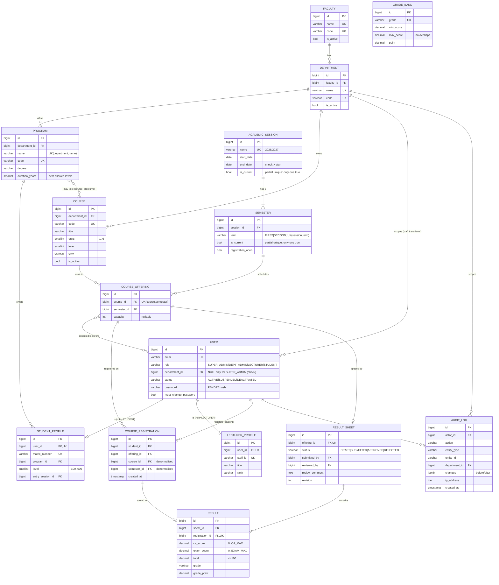

# Database design (ER diagram)

PostgreSQL 16. Every table below maps 1:1 to a Django model. GitHub renders the
Mermaid diagram directly.

```mermaid
erDiagram
    FACULTY ||--o{ DEPARTMENT : has
    DEPARTMENT ||--o{ PROGRAM : offers
    DEPARTMENT ||--o{ COURSE : owns
    DEPARTMENT ||--o{ USER : "scopes (staff & students)"
    PROGRAM ||--o{ STUDENT_PROFILE : "enrols"
    PROGRAM }o--o{ COURSE : "may take (course_programs)"
    USER ||--o| STUDENT_PROFILE : "is (role=STUDENT)"
    USER ||--o| LECTURER_PROFILE : "is (role=LECTURER)"
    ACADEMIC_SESSION ||--|{ SEMESTER : "has 2"
    COURSE ||--o{ COURSE_OFFERING : "runs as"
    SEMESTER ||--o{ COURSE_OFFERING : schedules
    COURSE_OFFERING }o--o{ USER : "allocated lecturers"
    COURSE_OFFERING ||--o{ COURSE_REGISTRATION : "registered on"
    USER ||--o{ COURSE_REGISTRATION : "registers (student)"
    COURSE_OFFERING ||--o| RESULT_SHEET : "graded by"
    RESULT_SHEET ||--o{ RESULT : contains
    COURSE_REGISTRATION ||--o| RESULT : "scored as"
    USER ||--o{ AUDIT_LOG : "acts"
    DEPARTMENT ||--o{ AUDIT_LOG : "scopes"

    FACULTY {
        bigint id PK
        varchar name UK
        varchar code UK
        bool is_active
    }
    DEPARTMENT {
        bigint id PK
        bigint faculty_id FK
        varchar name UK
        varchar code UK
        bool is_active
    }
    PROGRAM {
        bigint id PK
        bigint department_id FK
        varchar name "UK(department,name)"
        varchar code UK
        varchar degree
        smallint duration_years "sets allowed levels"
    }
    USER {
        bigint id PK
        varchar email UK
        varchar role "SUPER_ADMIN|DEPT_ADMIN|LECTURER|STUDENT"
        bigint department_id FK "NULL only for SUPER_ADMIN (check)"
        varchar status "ACTIVE|SUSPENDED|DEACTIVATED"
        varchar password "PBKDF2 hash"
        bool must_change_password
    }
    STUDENT_PROFILE {
        bigint id PK
        bigint user_id FK,UK
        varchar matric_number UK
        bigint program_id FK
        smallint level "100..600"
        bigint entry_session_id FK
    }
    LECTURER_PROFILE {
        bigint id PK
        bigint user_id FK,UK
        varchar staff_id UK
        varchar title
        varchar rank
    }
    ACADEMIC_SESSION {
        bigint id PK
        varchar name UK "2026/2027"
        date start_date
        date end_date "check > start"
        bool is_current "partial unique: only one true"
    }
    SEMESTER {
        bigint id PK
        bigint session_id FK
        varchar term "FIRST|SECOND; UK(session,term)"
        bool is_current "partial unique: only one true"
        bool registration_open
    }
    COURSE {
        bigint id PK
        bigint department_id FK
        varchar code UK
        varchar title
        smallint units "1..6"
        smallint level
        varchar term
        bool is_active
    }
    COURSE_OFFERING {
        bigint id PK
        bigint course_id FK "UK(course,semester)"
        bigint semester_id FK
        int capacity "nullable"
    }
    COURSE_REGISTRATION {
        bigint id PK
        bigint student_id FK
        bigint offering_id FK
        bigint course_id FK "denormalised"
        bigint semester_id FK "denormalised"
        timestamp created_at
    }
    RESULT_SHEET {
        bigint id PK
        bigint offering_id FK,UK
        varchar status "DRAFT|SUBMITTED|APPROVED|REJECTED"
        bigint submitted_by FK
        bigint reviewed_by FK
        text review_comment
        int revision
    }
    RESULT {
        bigint id PK
        bigint sheet_id FK
        bigint registration_id FK,UK
        decimal ca_score "0..CA_MAX"
        decimal exam_score "0..EXAM_MAX"
        decimal total "<=100"
        varchar grade
        decimal grade_point
    }
    GRADE_BAND {
        bigint id PK
        varchar grade UK
        decimal min_score
        decimal max_score "no overlaps"
        decimal point
    }
    AUDIT_LOG {
        bigint id PK
        bigint actor_id FK
        varchar action
        varchar entity_type
        varchar entity_id
        bigint department_id FK
        jsonb changes "before/after"
        inet ip_address
        timestamp created_at
    }
```
